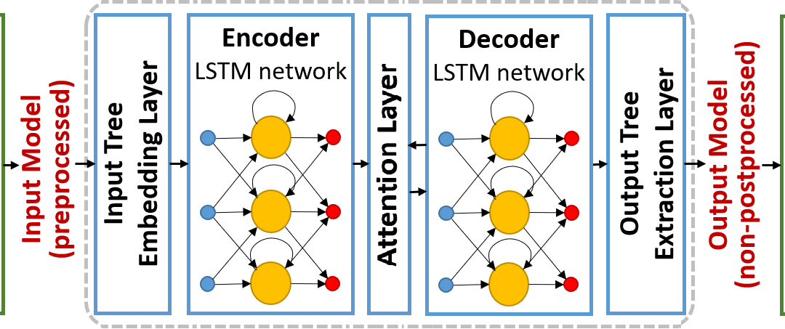

# OpportunityStonks

an application that predicts the share price in the future

This application is targeted for the `JSE Market`.

## Disclaimer
this application wont run in Windows properly due to the `MVC Compiler for C++` but you can work around that by using Anaconda. Not a fan of it and i wont be using it so in development i used `Ubuntu Linux` so follow the steps in usage and you can get this app working. This app also runs in AWS.

## Usage
Take a look at the notebooks etc to see how i planned my app. I tried many routes i found `Prophet` was the fastest in terms of accuracy and speed.
The Dash app is imcomplete - i had plans to merge the ADGSDK into Dash. Orignal idea was to use `Keras` and `Dash` as the Data Science Stack.

If you want to this application to predict far greater years of forecasting, `git clone` my repo.

To run app once cloned 

you need to install requirements you can do this by running `pip3 -r requirements.txt`

Running app

`streamlit run streamlitapp.py`

## About Models + Math

- For `predicting-stockprice-neuralnetwork.ipynb`

- For main web app `streamlitapp.py`

#### To view the live application visit 

[Stonks App](https://stonks.adgstudios.co.za)

### Copyright (c) Ashlin Darius Govindasamy 
