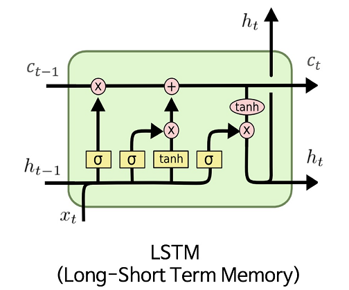

# OpportunityStonks

This application is targeted for the `JSE Market`.

an application that finds the opportunity to buy shares at low that will go to the moon in a few years.

## About Models + Math

- For `predicting-stockprice-neuralnetwork.ipynb`

- For main web app `streamlitapp.py`

#### To view the live application visit 

[Stonks App](https://stonks.adgstudios.co.za)

### Copyright (c) Ashlin Darius Govindasamy 
